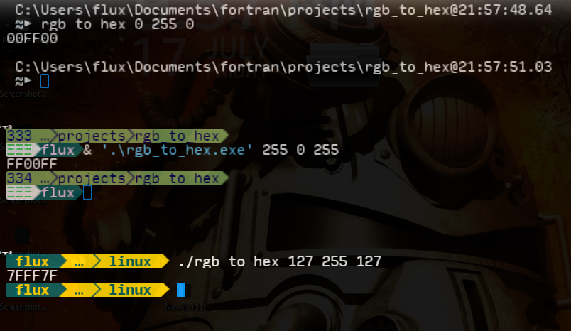

# Rgb To Hex Fortran


 

Cross-platform command line interface program that converts RGB (Red,Green,Blue) integers into their corresponding hexadecimal value.

## Index

- [Rgb To Hex Fortran](#rgb-to-hex-fortran)
  - [Index](#index)
  - [Usage <a name="usage"></a>](#usage)
    - [Windows <a name="windows"></a>](#windows)
      - [CMD <a name="cmd"></a>](#cmd)
      - [PowerShell <a name="Powershell"></a>](#powershell)
    - [Linux <a name="linux"></a>](#linux)
      - [Shell <a name="shell"></a>](#shell)
  - [Motivation <a name="motivation"></a>](#motivation)
  - [Files <a name="files"></a>](#files)
  - [Screen Shot <a name="screen"></a>](#screen-shot)
  - [License <a name="license"></a>](#license)

## Usage <a name="usage"></a>

Used like any other command line utility:

```
rgb_to_hex [0-255] [0-255] [0-255]
```

### Windows <a name="windows"></a>

#### CMD <a name="cmd"></a>

```CMD
 > rgb_to_hex 0 255 0
00FF00
 > REM or:
 > C:\path\to\rgb_to_hex.exe 255 0 0
FF0000
```
#### PowerShell <a name="Powershell"></a>

```PowerShell
 >& ./rgb_to_hex.exe 0 255 0
00FF00
 > # or:
 > & C:\path\to\rgb_to_hex.exe 255 0 0
FF0000
```
### Linux <a name="linux"></a>

#### Shell <a name="shell"></a>

```Shell
 $ # if in $PATH
 $ rgb_to_hex 255 0 255
FF00FF
 $ # or
 $ ./rgb_to_hex 255 255 255
FFFFFF
 $ # other
 $ /path/to/rgb_to_hex 127 255 127
7FFF7F
```

## Motivation <a name="motivation"></a>

Another tool to add to my Cross-platform ***Fortran*** utilities.

## Files <a name="files"></a>

- [Source Files](./source.7z)
- [Windows - Compiled](./compile/windows/rgb_to_hex.exe)
- [Linux - Compiled](./compile/linux/rgb_to_hex)
- [This Repository](https://github.com/Lateralus138/Rgb-To-Hex-Fortran)
- [Release Page](https://lateralus138.github.io/Rgb-To-Hex-Fortran)

## Screen Shot <a name="screen"></a>



## [License](./LICENSE) <a name="license"></a>

>This program is free software: you can redistribute it and/or modify it under the terms of the GNU General Public License as published by the Free Software Foundation, either version 3 of the License, or (at your option) any later version.

>This program is distributed in the hope that it will be useful, but WITHOUT ANY WARRANTY; without even the implied warranty of MERCHANTABILITY or FITNESS FOR A PARTICULAR PURPOSE.  See the GNU General Public License for more details.